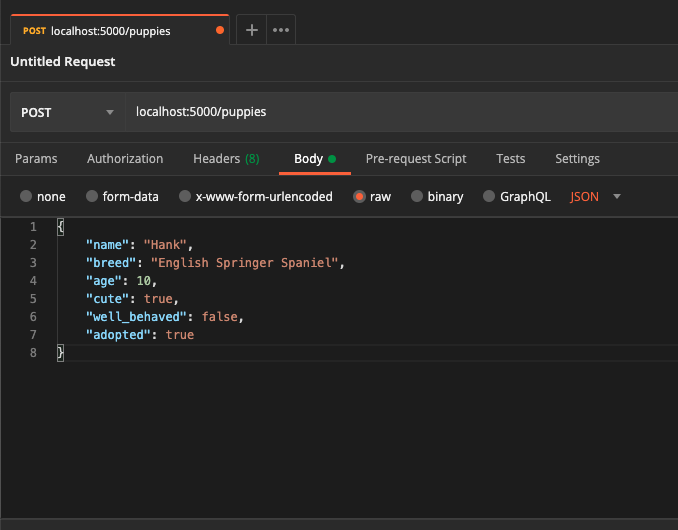
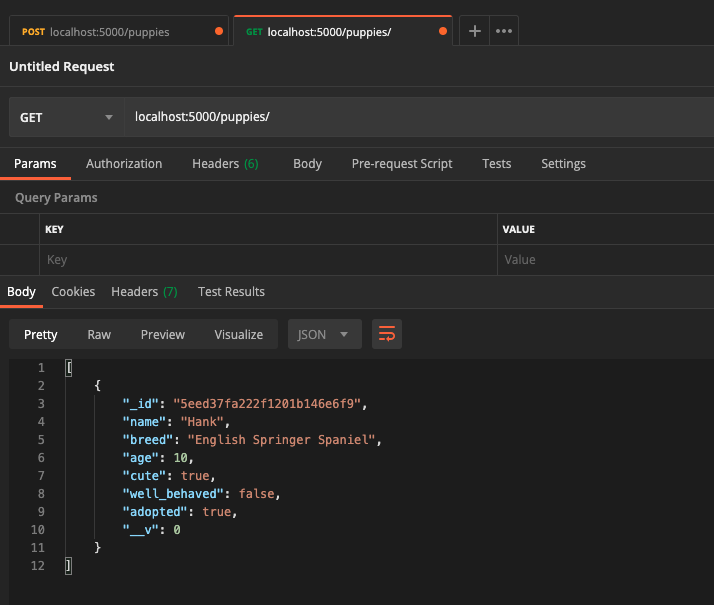
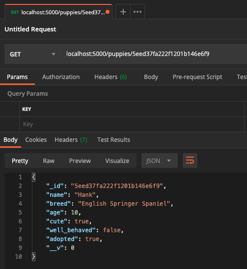
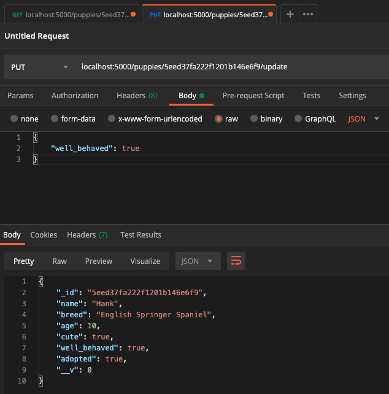

> Previously in this series we walked through [setting up your first Express server](https://thecodepixi.dev/your-first-express-server), and then setting up [the beginnings of an Express API](https://thecodepixi.dev/setting-up-an-express-api-with-mongoose) with Mongoose/MongoDB data storage.

> This post will jump off exactly where we left of in [the previous post](https://thecodepixi.dev/setting-up-an-express-api-with-mongoose), so if you haven't been following along, I recommend at least going back and reading through that post first.

<small>
  <em>
    If you prefer to jump straight into the code, you can find that{" "}
    <a href="https://github.com/thecodepixi/puppy-rest-api">here</a>
  </em>
</small>
<br />
<br />

## Getting Started...

In the last installment in this series, we left off with having just completed our first Mongoose Schema and database Model. This means we're ready to start building our router and our API endpoints!

The first thing we need to do is create a new folder in the top level directory of our project called `routers` and put a file inside that folder called `puppy.js`

```zsh
$ mkdir routers
$ touch puppy.js
```

Then we want to tell our Express server (in `index.js`) that we want to `use(puppy.js)` for our Puppy routing endpoints.

Here's how we'll do this:

```js
// index.js

const puppyRouter = require("./routers/puppy")
app.use("/puppies", puppyRouter)
```

_these new lines of code can go directly beneath your Mongoose `connection` function call_

What the above is doing is telling our Express server that for any endpoint starting with `/puppies` we want it to use the routing specified in our `puppy.js` file.

## Now What?

So we've told our Express server to use the `puppy` router. Now what do we put in there to make this work?

To start writing our routes, we first need to open up our `puppy.js` file and add some requirements.

First, in order to create our routes, we need to `require` the Express `Router`:

```js
//puppy.js
const router = require("express").Router()
```

This `router` constant will be used to call all of our routing functions.

Then we also need to require the `Puppy` model we previously created, so that we can use our model to acces and make changes to data in our MongoDB database.

```js
//puppy.js
const router = require("express").Router()
const Puppy = require("../models/Puppy.model")
```

Creating a route in Express is as easy as using the correct HTTP verb function (ie: `get`, `post`, etc) and pass in the route we want to use to preform that action.

_the rest of the code in this tutorial is going to be written inside of `puppy.js`_

## Reading from our MongoDB Collection

We're going to start off easy and write a route to access _all_ of our puppies!


To do this, we're going to access our `Puppy` model using some built-in Mongoose functions. Since our `const Puppy` points to a Mongoose model, we don't also need to `require(mongoose)` here, which I think is a nice perk!

First, we need to set up an Express `get` request:

```js
router.get("/", (req, res) => {
  res.send("Gimme the puppies!")
})
```

If you go ahead and start your server _(using the `dev` script we added in a previous lesson)_ and navigate to `localhost:5000/puppies/` you should see the string 'Gimme the puppies!'.

What's happening here is we are telling Express we want to `get` the `/` route, and then we pass a callback that includes the `req` (or request object), and the `res` (or response). Then we're telling Express the `send` the string "Gimme the puppies!" as our response.

Pretty cool, right!?

**Now, let's get fancy**

We're going to add onto this route and use the built in Mongoose method `find` to access every `Puppy` in our collection.

```js
router.get("/", (req, res) => {
  Puppy.find()
    .then(puppies => res.json(puppies))
    .catch(err => res.status(400).json("Error: " + err))
})
```

Above, we are using the the same `get` request frame, and now we're using the Mongoose `find` method to access all of the instances of `Puppy` in our collection, and send them back to the response as JSON.

Since `find` is an **asynchronous** function, we use `then` to access and take action on the data that gets returned to us, only once the data has been returned. We also include a `catch` just in case there's an error. In this case, if there's an error, we send back a `400` status code to indicate a server error, and send back the error details as JSON. (_we will use this error format for every database request we write in this tutorial_)

Now if you were to look at this route in your browser, you'll see nothing returned. And that's a good thing! We haven't added a `Puppy` to our collection yet, so there's nothing to be returned.

Let's fix that...

## Updating Our Collection

Before we get started with sending our data to our database, we need a **way** to do that. My preferred method is a product called [Postman](https://www.postman.com). Postman allows you to manually test API endpoints by creating request bodies manually without needing an actual GUI form or interactive element to send your data with.

Go ahead and download Postman, and then come back for this next part, or if you have another API interaction tool you prefer feel free to use that!

Now that we have Postman, and are able to test our endpoints, we can go ahead and set up our first `post` route.

```js
router.post("/", (req, res) => {
  const name = req.body.name
  const breed = req.body.breed
  const age = Number(req.body.age)
  const cute = req.body.cute
  const well_behaved = req.body.well_behaved
  const adopted = req.body.adopted

  const newPuppy = new Puppy({
    name,
    breed,
    age,
    cute,
    well_behaved,
    adopted,
  })

  newPuppy
    .save()
    .then(() => res.json("New puppy created!"))
    .catch(err => res.status(400).json("Error: " + err))
})
```

This one's pretty long, so let's step through this code and talk about what's happening.

First, we set up our `post` request route, and pass in the root route (`/`). This will send the post request to `/puppies/`, which is the RESTful endpoint for adding new instances to our collection.

Then, we create some variables from the data passed in from our `req.body`, or the body of our request. When we test this endpoint, we're going to be passing in a set of key-value pairs where the `key` is the same as the data column we want to add to for this `Puppy`. If you _know_ that your data will always been passed to the API in this format (via some sort of client-side validation, for example) you can alternatively pass the entire `req.body` to `new Puppy()`.

We then take all of those variables and use them to create a `new` instance of our `Puppy` model. Once we have our instance of a `Puppy`, we can use the built in Mongoose function `save` to add this `Puppy` to our MongoDB collection. Just like the `find` method, the `save` method is **asynchronous**, so we will use `then` to send back our response. The `save` method does not return any data by default, so instead we'll just send back the string `"New puppy created!"` to indicate success here.

**Now we can save our router file and test this out in Postman!**



In the example above, you can see that I've chosen the `post` verb option from the dropdown on the left-hand side, passed in our full URL (localhost:5000/puppies/) and then used the request body creator below to pass in my `Puppy` data as raw JSON. (_Make sure to choose JSON from the dropdown!_)

Here's the puppy I created:

```json
//req.body
{
  "name": "Hank",
  "breed": "English Springer Spaniel",
  "age": 10,
  "cute": true,
  "well_behaved": false,
  "adopted": true
}
```

Then we can click "Send" and the result panel at the bottom will read "New puppy created!"


Now if we create a new tab using the `+` symbol button at the top, we can create a `get` request to `/puppies/` and see our new `Puppy` returned to us from the database!



Now we get back the puppy we created, and we can see that MongoDB automatically gave our instance of a `Puppy` an `_id` field populated with a unique ID code. We'll be using this `_id` field to `get` individual instances of a `Puppy`, as well as making updates via `put` request, and eventually, sadly, `delete`-ing puppies if necessary.

## Reading Specific Data

Now that we know how to add puppies to our collection, it's understandable that we won't _always_ want to get information about every single `Puppy` in our collection. Personally, I'm most interested in Hank, because he's _my_ puppy. So how do I access only the data about him?

We can use a method that's very similar to the `find` method we used previously. Mongoose provides us with the method `findById`, and it does exactly what it says on the tin. We simply pass in the `_id` of the `Puppy` we want to find.

To get access to the `_id` information, we're going to use a route `parameter` by adding on to our base `/puppies/` route. Here's the `get` request we'll be using:

```js
router.get("/:id", (req, res) => {
  res.send(`The id you want to get is ${req.params.id}`)
})
```

Using the above, if you navigate to `localhost:5000/puppies/123`, you should see the string "The id you want to get is 123" in your browser window.

We'll be using `req.params.id` to send a specific `_id` to MongoDB in order to access the specific `Puppy` we want.

```js
router.get("/:id", (req, res) => {
  Puppy.findById(req.params.id)
    .then(puppy => res.json(puppy))
    .catch(err => res.status(400).json("Error: " + err))
})
```

Now, we're using the aforementioned `findById` method, coupled with the `id` passed to us from `req.params.id` to request only that instance of a `Puppy`, and send the data back as JSON.

We can test this in Postman, using the `_id` that was assigned to the `Puppy` we previously created...

_your `_id` will be different, as each `_id` is completely unique_



As you should see above, we make a `get` request to `/puppies/:id`, passing in the `_id` for our previously created `Puppy` in place of `:id`, and we get back that instance of `Puppy`.

If you want to test this out further, I encourage you to create a few more `Puppy` instances using our previously created `post` route, and then access each of them one at a time using this new route.

## Updating Instances

Now that we're able to get data to and from our database, we also want to be able to make changes. In the event that a `Puppy` ages, gets adopted, or gets some training and becomes well behaved, we want to be able to update those details in our database.

This process is an amalgamation of what we've done so far. It's similar to `get`-ting and `post`-ing an individual instance of a `Puppy`. Remember how Mongoose gave us a convenient `findById` method? Mongoose also gives us a `findOneAndUpdate` method for finding and updating instances.

However, in order to use this function, we need to make an update to our `mongoose.connect` function in our `index.js` file.

```js
// index.js
mongoose.connect(uri, {
  useNewUrlParser: true,
  useUnifiedTopology: true,
  useFindAndModify: false, // this is the new line of code we're adding
})
```

In the above code block, passing another option to our `connect` function and telling Mongoose to set `useFindAndModify` to false. This will allow us to use the Mongoose `findOneAndUpdate` method. It's not important in this use case to understand why we're doing this, but if you want to learn more about this, you can check out the [Mongoose documentation](https://mongoosejs.com/docs/deprecations.html).

Now that we've got that sorted out, we can create our `update` route using the `put` http verb...

```js
router.put("/:id/update", (req, res) => {
  let updates = req.body //we set a variable equal to the entire req.body

  Puppy.findOneAndUpdate({ _id: req.params.id }, updates, { new: true })
    .then(updatedPuppy => res.json(updatedPuppy))
    .catch(err => res.status(400).json("Error: " + err))
})
```

In this scenario, we are assuming that the only data being passed in the `req.body` are the updates being made to this specific puppy. Otherwise, we would need to write some extra code to extract the specific updates being made.

`findOneAndUpdate` conveniently indentifies whether the instance being accessed already has the `key` (or multiple keys) being passed in by the update object. And since we created this model using a schema, we are only allowed to update columns that already exist. If we were to try to send an update that included a column that does not exist, no updates will be made to the database.

`findOneAndUpdate` takes in 2 required arguments, and one optional:
First we find the `Puppy` we're targeting by looking for a `Puppy` instance with a matching `_id` (`{ _id: req.params.id }`), then we pass in the `updates` variable as the second argument. We can also include `{ new: true }` as an optional third argument, which will cause the updated `Puppy` data to be returned from the function.

We can test this new endpoint, again using Postman. Let's say I got my `Puppy` Hank some training lessons, and he's now perfectly well behaved. I can send an update to this endpoint, and in the request body test `well_behaved` to `true`:



You should see above that I sent the request to this new endpoint that I described above, and in the reponse we see the updated `Puppy` instance for Hank, where `well_behaved` is now set to `true`.

## Deleting Data

Sadly, the only thing left to do is to delete some of our puppies.

__

Since you've been following along, I bet you can guess what http verb we need to use this time: `delete`!

Similarly to the built in `findOneAndUpdate` method, Mongoose also provides us with a convenient `findByIdAndDelete` method.

Here's how we'll utilize this method in our API:

```js
router.delete("/:id", (req, res) => {
  Puppy.findByIdAndDelete(req.params.id)
    .then(() => res.json("Puppy deleted =( "))
    .catch(err => res.status(400).json("Error: " + err))
})
```

This works pretty similarly to our `findById` method. We pass in the `_id` of our `Puppy` as a request `param`, and the method does the rest of the work for us. As with all of our other Mongoose methods, this is **asynchronous**, and like the `save` method does not return any data to us. Instead we send back the string `"Puppy deleted =("` to indicate successful deletion.

Test this route at your own peril, because deleting puppies is pretty sad!

## Wrapping Up

Congrats! You made it through every single CRUD action with Express and Mongoose! Now it's time to celebrate 🎉

If you made it this far I just want to say: **Thank you and I'm so proud of you!**

I encourage you to use what you've learned here to build your own REST API with Express and Mongoose to practice what you've learned.

If you do follow this tutorial and build an API of your own I'd love to see it! Share what you've made with [on Twitter](https://twitter.com/thecodepixi)

If you want to find out when I put out new blog posts and tutorials, you can [follow me on Twitter](https://twitter.com/thecodepixi), where I always post links as soon as my new posts are available.

I also cross-post all of my articles to [DEV](https://dev.to/thecodepixi) if you prefer to read articles and tutorials there.
